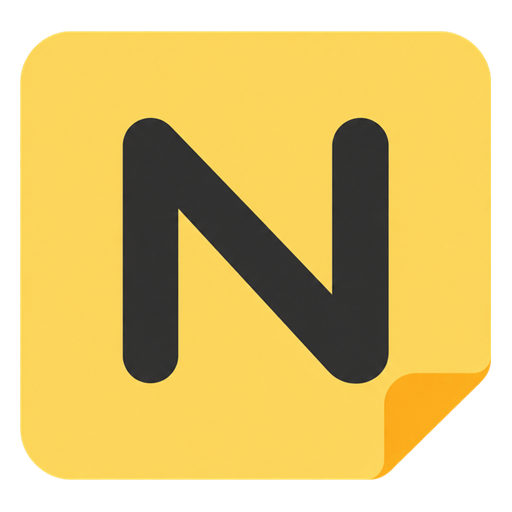

# StickyN

A portable Windows desktop sticky-note app. Write on paper-style notes, format text, and lock notes in place.

[Download StickyN](https://github.com/w-rakeeb/StickyN/releases/latest)

## Getting started

Download StickyN.exe from a release, put it in a writable folder, and open it. The Windows x64 runtime is included. Settings can create a desktop shortcut.

Built for Windows 10 and 11. Windows 11 is tested; a physical Windows 10 test remains outstanding.

- Fifteen paper designs, ten color circles, a HEX color picker and custom gradients.
- Handwriting fonts, text size, bold, italic, underline, strike, lists, and H1-H4.
- Resizable notes with protected position, size, and text when locked.
- Freely movable subnotes; to-do notes with outlined square, circle or star checkboxes.
- Local photo previews, clickable links and document attachments.
- Search, recoverable Trash, portable backups with attachments, and local autosave.
- Five app styles, light/dark/system appearance, optional startup and silent mode.

## Updates

Settings offers Check for updates and an automatic-check preference. Checks run at most every 12 hours and do not install anything until Update and restart is selected. The app verifies the publisher signature and the downloaded executable, saves notes, and restarts. The previous executable is retained for recovery.

Only published stable releases enter the update channel. A source edit or Git commit is not an app update.

The update manifest is signed with a dedicated publisher key. UpdatePublicKey.txt contains the public verification key. This signature protects the update package; it is separate from a Windows Authenticode certificate. The executable does not currently have a Windows certificate signature.

## Privacy

Notes and settings stay in %LOCALAPPDATA%\StickyN. They are not uploaded to GitHub. Update checks contact GitHub for release information and downloads. Automatic checks can be turned off, and the app remains usable offline. No GitHub login is required by users.

This repository distributes app releases and public release information. It does not contain private notes, publisher credentials, or the application source.